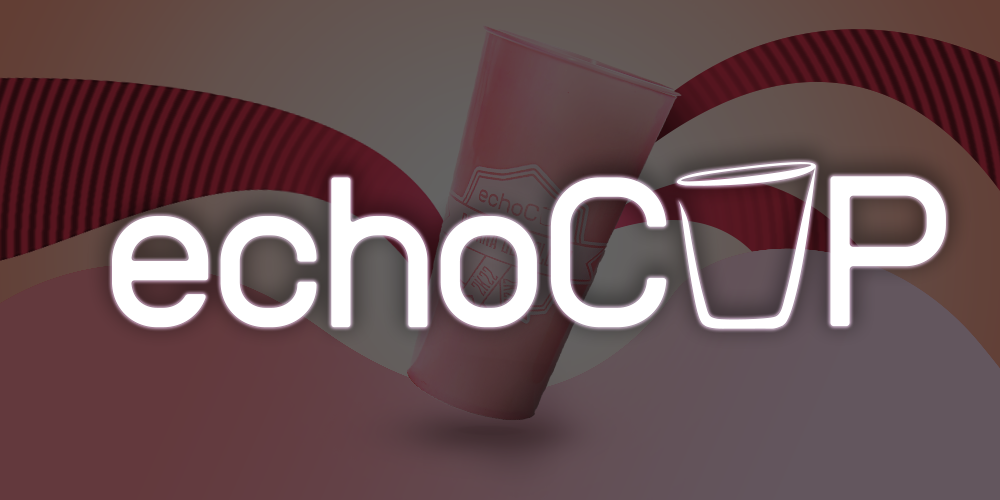

<h1 align="center">EchoCup</h1>

    Um projeto de E-commerce feito exclusivamente para o evento <strong> Semana do Colégio</strong> realizado em um ambiente escolar

  <a href="http://projetoscti.com.br/projetoscti23/echoCup">Projeto em funcionamento!</a>

## 🚀 Tecnologias

Esse projeto foi desenvolvido com as seguintes tecnologias:

- HTML e CSS
- PHP